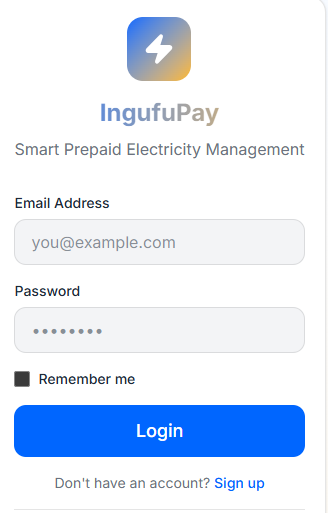

# IngufuPay - Smart Prepaid Electricity Payment System

## Table of Contents
- [Description](#description)
- [Features](#features)
- [Prerequisites](#prerequisites)
- [Environment Setup](#environment-setup)
- [Installation & Setup](#installation--setup)
- [Configuration](#configuration)
- [Running the Application](#running-the-application)
- [Designs & Documentation](#designs--documentation)
- [API Documentation](#api-documentation)
- [Deployment Plan](#deployment-plan)
- [Contributing](#contributing)
- [License](#license)

## Description

**IngufuPay** is a comprehensive digital platform for managing prepaid electricity payments and monitoring power consumption. The system enables both household and institutional users to:

- Register and manage multiple electricity meters
- Check real-time meter balances and consumption
- Purchase electricity units through mobile money providers (MTN, Airtel)
- Generate and redeem token-based purchases
- Track payment history and transaction records
- Receive low-balance alerts and consumption notifications
- Generate detailed consumption reports

The platform features a **Django REST Framework backend** providing RESTful APIs and a **responsive vanilla JavaScript frontend** for seamless user experience across devices.

### Target Users
- **Household Users**: Individual customers managing residential meters
- **Institution Users**: Organizations managing multiple meters across different locations, departments, and buildings

---

## Features

### Core Functionality
**User Authentication & Authorization**
- Secure login/registration with JWT tokens
- Role-based access control (household vs. institution)
- Profile management

**Meter Management**
- Register multiple meters
- Monitor real-time balance and consumption
- Meter status tracking (Active, Inactive, Suspended)
- Building and department categorization for institutions

**Payment Processing**
- Multiple payment provider integration (MTN Mobile Money, Airtel Money)
- Real-time unit conversion and pricing
- Transaction status tracking (Pending, Success, Failed)
- Automatic balance updates

**Token System**
- Generate prepaid tokens for offline distribution
- Manual token redemption
- Token expiry management
- Redeemed token tracking

**Transaction History & Reporting**
- Comprehensive transaction logging
- Filterable transaction history by date, type, status
- Transaction receipt generation
- Monthly consumption reports

**Alerts & Notifications**
- Low balance warnings
- Consumption threshold notifications
- Payment confirmation alerts

---


## Prerequisites

Ensure you have the following installed on your system:

### Backend Requirements
- **Python 3.9+** - [Download](https://www.python.org/downloads/)
- **pip** - Python package manager (usually comes with Python)
- **Git** - [Download](https://git-scm.com/)

### Frontend Requirements
- **Node.js 16+** (optional, for local development server) - [Download](https://nodejs.org/)
- Modern web browser (Chrome, Firefox, Safari, Edge)

### Database
- **SQLite** 
- **PostgreSQL 12+** (recommended for production) - [Download](https://www.postgresql.org/)

---

## Environment Setup

### 1. Clone the Repository

```bash
git clone https://github.com/ykwizera/IngufuPay.git
cd IngufuPay
```

### 2. Create Virtual Environment (Backend)

#### On Windows (PowerShell):
```powershell
python -m venv venv
.\venv\Scripts\Activate.ps1
```

#### On macOS/Linux:
```bash
python3 -m venv venv
source venv/bin/activate
```

### 3. Install Backend Dependencies

```bash
cd backend
pip install -r requirements.txt
```

---

## Installation & Setup

### Backend Setup

#### Step 1: Navigate to Backend Directory
```bash
cd backend
```
#### Step 2: Create Environment Variables
Create a `.env` file in the `backend` directory:

```bash
# .env
DJANGO_SECRET_KEY=your-secret-key-change-this-in-production
DJANGO_DEBUG=True
DJANGO_ALLOWED_HOSTS=localhost,127.0.0.1
DATABASE_URL=sqlite:///db.sqlite3

# Mobile Money Providers (Mock)
MTN_MOMO_API_KEY=your-mtn-api-key
AIRTEL_MONEY_API_KEY=your-airtel-api-key

# Email Configuration (Optional)
EMAIL_BACKEND=django.core.mail.backends.console.EmailBackend
EMAIL_HOST=smtp.gmail.com
EMAIL_PORT=587
EMAIL_HOST_USER=your-email@gmail.com
EMAIL_HOST_PASSWORD=your-email-password

# Celery Configuration
CELERY_BROKER_URL=redis://localhost:6379
CELERY_RESULT_BACKEND=redis://localhost:6379

# CORS Settings
CORS_ALLOWED_ORIGINS=http://localhost:3000,http://localhost:8000
```

#### Step 3: Run Database Migrations
```bash
python manage.py migrate
```

#### Step 4: Create Superuser (Admin)
```bash
python manage.py createsuperuser
# Follow prompts to create admin account
```

#### Step 5: Collect Static Files (for production)
```bash
python manage.py collectstatic --noinput
```

### Frontend Setup

#### Step 1: Navigate to Frontend Directory
```bash
cd ../frontend/web
```

#### Step 2: Create Frontend Configuration
Create `js/config.js` (if not exists):

```javascript
// js/config.js
const Config = {
    API_BASE_URL: 'http://localhost:8000/api',
    APP_NAME: 'IngufuPay',
    FEATURES: {
        ENABLE_OFFLINE_MODE: true,
        ENABLE_DARK_MODE: false,
        ENABLE_NOTIFICATIONS: true
    },
    PAYMENT_PROVIDERS: ['MTN_MOMO', 'AIRTEL_MONEY'],
    SESSION_TIMEOUT: 60 * 60 * 1000 // 1 hour in milliseconds
};
```

---
## Running the Application

### Start Backend Server

```bash
# From backend directory
python manage.py runserver

# Server runs at http://localhost:8000
# Admin panel: http://localhost:8000/admin
# API: http://localhost:8000/api
```

### Start Frontend Server

```bash
# From frontend/web directory
python -m http.server 8001

# Access at http://localhost:8001
```

## Designs & Documentation

### Figma Mockups

https://www.figma.com/make/fDkIW5Hlfm7nvPZ3QjB6Pe/IngufuPay-Web-Application?fullscreen=1&t=L53spbRlejvJww5D-1&preview-route=%2Flogin

### screenshots

Log in 